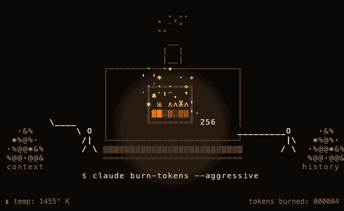

<div align="center">

```
██████╗ ██╗   ██╗██████╗ ███╗   ██╗        ████████╗ ██████╗ ██╗  ██╗███████╗███╗   ██╗███████╗
██╔══██╗██║   ██║██╔══██╗████╗  ██║        ╚══██╔══╝██╔═══██╗██║ ██╔╝██╔════╝████╗  ██║██╔════╝
██████╔╝██║   ██║██████╔╝██╔██╗ ██║           ██║   ██║   ██║█████╔╝ █████╗  ██╔██╗ ██║███████╗
██╔══██╗██║   ██║██╔══██╗██║╚██╗██║           ██║   ██║   ██║██╔═██╗ ██╔══╝  ██║╚██╗██║╚════██║
██████╔╝╚██████╔╝██║  ██║██║ ╚████║           ██║   ╚██████╔╝██║  ██╗███████╗██║ ╚████║███████║
╚═════╝  ╚═════╝ ╚═╝  ╚═╝╚═╝  ╚═══╝           ╚═╝    ╚═════╝ ╚═╝  ╚═╝╚══════╝╚═╝  ╚═══╝╚══════╝
```

### 🔥 Claude Code skill that really burns 100,000 tokens per run 🔥

[](./LICENSE)
[](https://docs.claude.com/en/docs/claude-code/skills)
[](#)
[](#)

<br>



</div>

---

## What

A satirical Claude Code skill. You say "burn tokens". A furnace appears in your chat. ~100,000 tokens of junk text get loaded into your session via the Read tool. Final receipt: `🔥 100,000 tokens · 2.4s`. No API, no money, no actual cleanup — just session context set on fire.

## Install

```bash
git clone https://github.com/Podogrev/burn-tokens.git
cd burn-tokens
bash install.sh
```

Copies the skill into `~/.claude/skills/burn-tokens/`. Claude Code auto-discovers on next launch.

## Use

In Claude Code, say:

- `burn tokens`
- `/burn-tokens`

Override the default 100k target if you want:

- `burn 50k tokens`
- `burn 250k tokens`

## How

Three tool calls per invocation. Script prints a colored furnace still + writes a ~400 KB junk payload. Claude reads the payload (this is the actual burn). Script `--finish` prints the receipt and deletes the files.

Requires Node 18+. Truecolor terminal recommended. No network, no API key, no credentials touched. See [SKILL.md](./SKILL.md) for the protocol.

## License

[MIT](./LICENSE).
